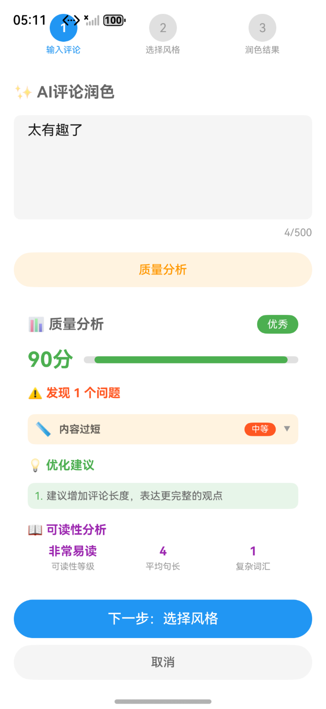
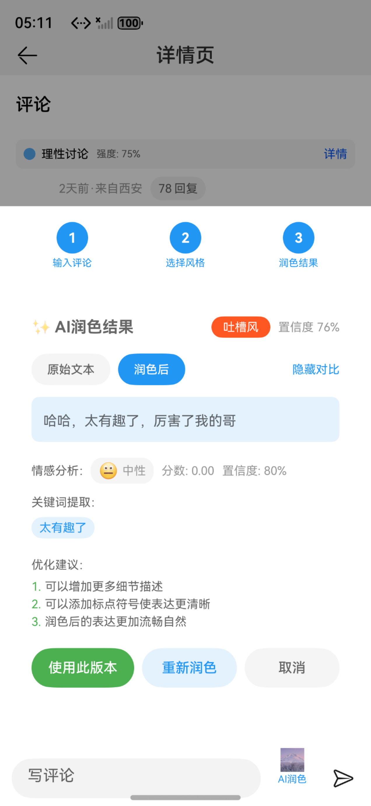

# Community Comments

## Overview

Based on the adaptive and responsive layout, implement community comment pages with one-time development for multi-device deployment.

## Effect
The figure shows the effect on the Bar phone:


The figure shows the effect on the Bi-fold phone:


The figure shows the effect on the Tablet:


## Concepts

- One-time development for multi-device deployment: It enables you to develop and release one set of project code for deployment on multiple devices as demanded. This feature enables you to efficiently develop applications that are compatible with multiple devices while providing distributed user experiences for cross-device transferring, migration, and collaboration.
- Adaptive layout: When the size of an external container changes, elements can automatically change based on the relative relationship to adapt to the external container. Relative relationships include the proportion, fixed aspect ratio, and display priority.
- Responsive layout: When the size of an external container changes, elements can automatically change based on the breakpoints, grids, or specific features (such as the screen direction and window width and height) to adapt to the external container.
- GridRow: It is a container that is used in a grid layout, together with its child component **<GridCol>**.
- GridCol: It is a container that must be used as a child component of the **<GridRow>** container.
- Free Flow Feature: Supports application flow between multiple devices for seamless cross-device experience. Three flow modes: (1) Migration: Migrate the application from the current device to the target device to continue using; (2) Collaboration: Multi-device collaboration for cross-device interaction; (3) Synchronization: Synchronize application state to other devices. Device type identification: phone, tablet, foldable screen, smart screen.

## How to Use

1. Install and open an app on a Bar phone, Bi-fold phone, or tablet. The responsive layout and adaptive layout are used to display different effects on the app pages over different devices.
2. Tap home, hot topics, message, or mine tab at the bottom to switch to the corresponding tab page. By default, the message tab page is displayed.
3. Tap a category of hot searches to switch to the corresponding list.
4. Tap the button for viewing complete rankings. The hot search rankings page is displayed. You can swipe up, down, left, or right on the hot search rankings page and tap the back button to return to the hot topics page.
5. Tap an image on the hot topics page to go to the image details page. Only images are displayed on mobile phones, while the content and comments are displayed with images on foldable phones and tablets. Tap the image or the back button to return to the hot topics page.
6. Tap the widget body on the hot topics page to go to the details page. The text area on the details page can be zoomed in or out with two fingers. You can tap the button in the upper right corner of the foldable phone to switch between the left-right layout and top-down layout. Tap the back button to return to the hot topics page.

### New Features

#### 1. Stance Voting
- For controversial topics, a stance voting component is displayed at the top of the comment list
- Users can choose their stance: Support (green), Oppose (red), Neutral (orange)
- Real-time display of voting ratio and percentage for each stance
- Supports canceling and re-selecting

**Preview:**


#### 2. Comment Emotion Heatmap
- Emotion analysis results are displayed below each comment
- Supports 5 emotion types: Angry (red), Agree (green), Tease (orange), Rational Discussion (blue), Neutral (gray)
- Shows primary emotion and intensity percentage
- Click "Details" to expand and view the complete emotion distribution heatmap

**Preview:**


#### 3. Comment Quality Assessment
- High-quality comments display blue tags like "In-depth Analysis", "Professional Comment" and are prioritized
- Low-quality comments (spam, trolling, low-effort) are collapsed by default with collapse reasons shown
- Collapsed comments can be manually expanded and re-collapsed
- Color coding for quality levels: Blue (high quality), Gray (normal), Dark Orange (low quality)

**Preview:**


#### 4. Image-to-Image Comment Interaction
- Comment section supports uploading images, short videos, and stickers for replies
- Supports three media categories: Regular images, Same-style scenery, Funny memes
- Users can share their own photos of the same scenery for comparison
- Supports sending funny memes to add interactive fun
- Quick sticker selection for one-tap sending
- Supports multiple image uploads, up to 9 images
- Media preview supports click-to-enlarge viewing
- Videos display duration and playback controls

**Preview:**


#### 5. AI Comment Polish Feature
- Intelligent comment polishing and optimization system to enhance comment quality
- **Polish Styles**:
  - Literary: Poetic and elegant, picturesque
  - Sarcastic: Humorous and witty, amusing
  - Professional: Rational and in-depth, insightful
  - Casual: Lively and friendly, natural
  - Emotional: Sentimental resonance, touching
- **Key Features**:
  - AI-powered polishing while preserving original sentiment
  - Quality analysis to identify low-quality comments
  - Optimization suggestions to improve readability
  - Keyword extraction and sentiment analysis
  - Polish history with undo support
- **User Experience**:
  - Real-time preview of polished results
  - One-tap apply polished text
  - Multi-style comparison
  - Confidence score display

**Preview:**





#### 6. Like and Favorite Features
- Comments and posts support like and favorite functionality
- **Comment Like & Favorite**:
  - In comment list, each comment supports like and favorite
  - Tap heart icon to like, icon and count turn red (#FF6B6B)
  - Tap favorite icon to save, icon turns golden yellow (#FFB84D)
  - Like count updates in real-time, supporting increment and decrement
- **Post Like & Favorite**:
  - In post detail page, support liking and favoriting posts
  - After liking, heart icon turns red, count updates in real-time
  - After favoriting, icon turns golden, shows "Favorited" status
  - Support unlike and unfavorite operations
- **Card List Like & Favorite**:
  - In follow list cards, support quick like and favorite
  - After liking, count turns red; after favoriting, icon switches
  - Operation states saved independently, not affecting each other
- **Interactive Feedback**:
  - Likes use red (#FF6B6B) highlight color
  - Favorites use golden yellow (#FFB84D) highlight color
  - Visual feedback on tap for enhanced user experience
  - Smooth state transitions, support repeated operations

## Project Directory
```
├──commons/base/src/main/ets                       // Common capability layer
│  ├──constants
│  │  ├──BreakpointConstants.ets                   // Breakpoint constants
│  │  ├──BreakpointType.ets                        // Breakpoint type
│  │  └──CommonConstants.ets                       // Common constants
│  ├──model
│  │  ├──AICommentModel.ets                        // AI comment entity
│  │  ├──CardListModel.ets                         // Card entity
│  │  ├──CommentModel.ets                          // Comment entity (includes stance voting, emotion analysis, quality assessment data)
│  │  ├──ContinueModel.ets                         // Flow feature entity
│  │  ├──HotModel.ets                              // Entity for hot searches
│  │  └──PictureArrayModel.ets                     // Picture entity
│  ├──service
│  │  ├──DeviceManagerService.ets                  // Distributed device management service
│  │  └──ContinueService.ets                       // Flow business service
│  ├──utils
│  │  └──Logger.ets                                // Logger
│  └──viewmodel
│      └──CommentViewModel.ets                     // Comment management (includes stance voting, emotion analysis, quality assessment data structures)
├──features
│  ├──detail/src/main/ets
│  │  ├──constants
│  │  │  └──CommonConstants.ets                    // Constants for details page
│  │  ├──service
│  │  │  └──AIPolishService.ets                    // AI polish service
│  │  ├──view
│  │  │  ├──AIPolishPanelView.ets                  // AI polish panel component
│  │  │  ├──AIPolishResultView.ets                 // AI polish result component
│  │  │  ├──AIPolishStyleView.ets                  // AI polish style component
│  │  │  ├──AIQualityAnalysisView.ets              // AI quality analysis component
│  │  │  ├──CommentBarView.ets                     // Comment bar
│  │  │  ├──CommentInputView.ets                   // Comment input bar
│  │  │  ├──CommentInputWithAIView.ets             // AI comment input bar
│  │  │  ├──CommentItemView.ets                    // Comment items
│  │  │  ├──CommentListView.ets                    // Comment list
│  │  │  ├──CommentQualityView.ets                 // Comment quality assessment component
│  │  │  ├──ContinueButtonView.ets                 // Flow floating button component
│  │  │  ├──ContinuePanelView.ets                  // Flow panel component
│  │  │  ├──DetailPage.ets                         // Details page
│  │  │  ├──DetailPageWithAI.ets                   // AI-enhanced details page
│  │  │  ├──DetailTitleView.ets                    // Title bar of details page
│  │  │  ├──EmotionHeatmapView.ets                 // Comment emotion heatmap component
│  │  │  ├──MediaPickerView.ets                    // Media picker component (image-to-image comment)
│  │  │  ├──MediaGalleryView.ets                   // Media display component (image-to-image comment)
│  │  │  ├──MircoBlogView.ets                      // Card information
│  │  │  └──StanceVoteView.ets                     // Stance voting component
│  │  └──viewmodel
│  │     ├──CardArrayViewModel.ets                 // Card list management
│  │     └──CardViewModel.ets                      // Card management
│  ├──hot/src/main/ets
│  │  ├──constants
│  │  │  └──CommonConstants.ets                    // Constants for hot searches
│  │  ├──model
│  │  │  └──FollowModel.ets                        // Entity of following
│  │  └──view
│  │     ├──CardItemView.ets                       // Following card
│  │     ├──FollowView.ets                         // Following page
│  │     ├──FoundView.ets                          // Finding page
│  │     ├──HotColumnView.ets                      // List of hot searches
│  │     ├──HotPointPage.ets                       // Hot searches page
│  │     ├──HotTitleView.ets                       // Titles of hot searches
│  │     ├──SearchBarView.ets                      // Search bar
│  │     └──ToRankView.ets                         // Navigation of hot search ranking
│  ├──picture/src/main/ets
│  │  └──view
│  │     ├──DetailVerticalView.ets                 // Details displayed vertically
│  │     └──PictureDetail.ets                      // Picture details page
│  └──rank/src/main/ets
│     ├──constants
│     │  └──CommonConstants.ets                    // Constants for ranking
│     └──view
│        ├──HotListItemView.ets                    // Items of hot searches
│        ├──HotListView.ets                        // List of hot searches
│        └──HotRankPage.ets                        // Ranking page
└──products
   └──phone/src/main
      ├──ets
      │  ├──entryability
      │  │  └──EntryAbility.ets                    // Application entry
      │  ├──model
      │  │  └──TabBarModel.ets                     // Tab bar entity
      │  ├──pages
      │  │  └──MainPage.ets                        // Main page
      │  ├──view
      │  │  └──TabContentView.ets                  // Tab content of home page
      │  └──viewmodel
      │     └──TabBarViewModel.ets                 // Tab bar management
      └──resources                                 // Resource file directory
```

## How to Implement

The GridRow and GridCol components are used to implement a community comment page for multiple devices based on adaptive and responsive layouts.

### New Feature Implementation

#### Stance Voting
- **Component**: `StanceVoteView.ets`
- **Data Structures**: `StanceType` enum, `StanceData` interface
- **Implementation**: Display voting component at the top of comment list for controversial topics, supports three stance choices, real-time display of voting ratio

#### Comment Emotion Heatmap
- **Component**: `EmotionHeatmapView.ets`
- **Data Structures**: `EmotionType` enum, `EmotionData` interface
- **Implementation**: Display emotion analysis results below each comment, use color coding and bar charts to show emotion distribution

#### Comment Quality Assessment
- **Component**: `CommentQualityView.ets`, `FoldableCommentContainer`
- **Data Structures**: `CommentQualityType` enum, `QualityData` interface
- **Implementation**: High-quality comments display tags and are prioritized, low-quality comments are automatically collapsed, supports manual expand/collapse

#### Image-to-Image Comment Interaction
- **Components**: `MediaPickerView.ets` (media picker), `MediaGalleryView.ets` (media display), `MediaPreviewView.ets` (media preview)
- **Data Structures**: `MediaType` enum (image, video, sticker), `MediaCategory` enum (regular, same-style scenery, funny meme), `MediaData` interface
- **Implementation**:
  - Integrate media selection button in comment input box, click to expand media picker
  - Support selecting images/videos from album or using stickers for quick reply
  - Media category tags help users quickly identify content type (same-style scenery, funny memes)
  - Comment list automatically displays media content, supports multi-image grid layout
  - Click media to enlarge preview, videos support playback controls

#### AI Comment Polish Feature
- **Components**: 
  - `AIPolishPanelView.ets` (polish panel)
  - `AIPolishResultView.ets` (polish result)
  - `AIPolishStyleView.ets` (style selection)
  - `AIQualityAnalysisView.ets` (quality analysis)
  - `CommentInputWithAIView.ets` (AI comment input bar)
- **Service**: `AIPolishService.ets` (AI polish service)
- **Data Structures**: 
  - `PolishStyle` enum (literary, sarcastic, professional, casual, emotional)
  - `PolishResult` interface (polish result)
  - `QualityAnalysisResult` interface (quality analysis result)
  - `PolishStyleConfig` interface (style configuration)
- **Implementation**:
  - Integrate AI polish button in comment input box, click to expand polish panel
  - Support 5 polish styles switching, each with unique theme color and example
  - AI-powered polishing preserves original sentiment, provides confidence score
  - Quality analysis identifies low-quality comments, offers optimization suggestions
  - Keyword extraction and sentiment analysis enhance comment readability
  - Polish history supports undo and re-apply
  - Real-time preview of polish effect, one-tap apply to input box

#### Like and Favorite Features
- **Components**: 
  - `CommentItemView.ets` (comment item)
  - `CardItemView.ets` (card item)
  - `MircoBlogView.ets` (post detail)
- **State Management**:
  - `isLiked`: Like status (boolean)
  - `isFavorited`: Favorite status (boolean)
  - `likeCount`: Like count (number)
- **Icon Resources**:
  - Like icon: `ic_toolbar_heart.svg` (heart icon)
  - Favorite icon: `ic_state_favor.png` (favorite state icon)
- **Implementation**:
  - Use `@State` decorator to manage like and favorite states
  - `toggleLike()` method handles like logic, supporting like/unlike
  - `toggleFavorite()` method handles favorite logic, supporting favorite/unfavorite
  - **Comment Like**: When liked, text and count turn red (#FF6B6B), heart icon remains unchanged
  - **Post Like**: When liked, count turns red, heart icon remains unchanged
  - **Card Like**: After liking, count turns red with obvious visual feedback
  - **Favorite**: When favorited, icon opacity changes from 0.3 to 1 (highlight), text turns golden yellow (#FFB84D)
  - Use `.onClick()` event listener for interactive response
  - Use `.opacity()` to control favorite icon transparency for visual feedback
  - States saved independently, likes and favorites don't affect each other

#### Free Flow Feature
- **Components**: `ContinueButtonView.ets` (flow button), `ContinuePanelView.ets` (flow panel)
- **Services**: `DeviceManagerService.ets` (device management), `ContinueService.ets` (flow service)
- **Data Structures**:
  - `DeviceInfo` interface (device information)
  - `ContinueData` interface (flow data)
  - `ContinueType` enum (migration, collaboration, synchronization)
  - `ContinueState` enum (flow state)
- **Implementation**:
  - Use HarmonyOS distributed device management API to discover and connect devices
  - Display flow floating button in bottom-right corner of main interface, click to open flow panel
  - Flow panel displays available device list, supports selecting flow type
  - Implement three flow modes: Migration (cross-device continue using), Collaboration (multi-device collaboration), Synchronization (state sync)
  - Real-time display of flow progress and status, supports canceling operation
  - Use listener pattern to implement state change notification

## Permissions

The following permissions are required:
- `ohos.permission.DISTRIBUTED_DATASYNC`: Distributed data synchronization permission
- `ohos.permission.GET_DISTRIBUTED_DEVICE_INFO`: Permission to get distributed device information

## Constraints

1. The sample app is supported only on Bar phone, Bi-fold (Mate X series) and Tablet running the standard system.
2. HarmonyOS: HarmonyOS 5.0.5 Release or later
3. DevEco Studio: DevEco Studio 6.0.2 Release or later
4. HarmonyOS SDK: HarmonyOS 6.0.2 Release SDK or later
