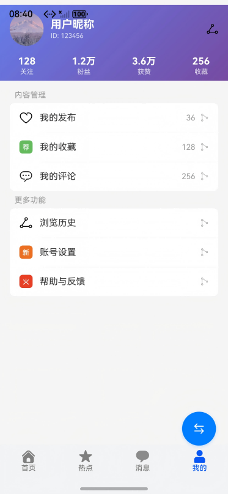
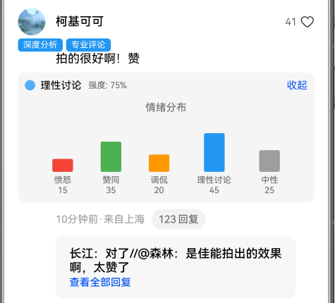

# 多设备社区评论界面

## 项目简介

基于自适应布局和响应式布局，实现一次开发，多端部署，支持自由流转的社区评论页。

## 效果预览
直板机运行效果图如下：


双折叠运行效果图如下：


平板运行效果图如下：


## 相关概念

- 一次开发，多端部署：一套代码工程，一次开发上架，多端按需部署。支撑开发者快速高效的开发支持多种终端设备形态的应用，实现对不同设备兼容的同时，提供跨设备的流转、迁移和协同的分布式体验。
- 自适应布局：当外部容器大小发生变化时，元素可以根据相对关系自动变化以适应外部容器变化的布局能力。相对关系如占比、固定宽高比、显示优先级等。
- 响应式布局：当外部容器大小发生变化时，元素可以根据断点、栅格或特定的特征（如屏幕方向、窗口宽高等）自动变化以适应外部容器变化的布局能力。
- GridRow：栅格容器组件，仅可以和栅格子组件（GridCol）在栅格布局场景中使用。
- GridCol：栅格子组件，必须作为栅格容器组件（GridRow）的子组件使用。
- 自由流转功能：支持多设备间的应用流转，实现跨设备无缝体验。三种流转模式：(1)迁移：将应用从当前设备迁移到目标设备继续使用；(2)协同：多设备协同工作，实现跨设备互动；(3)同步：将应用状态同步到其他设备。设备类型识别：手机、平板、折叠屏、智慧屏。效果如图所示：


## 使用说明

1. 分别在直板机、双折叠、平板安装并打开应用，不同设备的应用页面通过响应式布局和自适应布局呈现不同的效果。
2. 点击底部首页、热点、消息、我的图片文字按钮，切换显示对应的标签页，默认显示热点标签页。
3. 点击热搜标题，切换热搜列表。
4. 点击查看完整榜单按钮，跳转至热搜榜单页。热搜榜单页支持上下及左右滑动，点击返回按钮退回至热点页。
5. 热点页点击图片进入图片详情页。手机设备只展示图片，折叠屏及平板展示正文及评论。点击图片或返回按钮退回至热点页。
6. 热点页点击卡片正文进入详情页。详情页正文文字区域支持双指缩放。折叠屏右上角按钮支持切换左右及上下布局。点击返回按钮退回至热点页。

### 页面说明

#### 1. 首页
- 个性化推荐内容展示
- **搜索功能**：
  - 顶部搜索栏，支持搜索感兴趣的内容
  - 快速访问个人中心
- **轮播展示**：
  - 自动轮播热门内容
  - 支持手动滑动切换
  - 显示指示器位置
- **快捷入口**：
  - 推荐、关注、热门、同城四个快捷入口
  - 一键跳转到对应分类内容
- **推荐列表**：
  - 智能推荐优质内容卡片
  - 展示用户信息、发布时间
  - 支持点赞、评论互动

  **效果展示：**

  

#### 2. 热点页
- 热门内容聚合展示
- **热搜榜单**：
  - 多个分类热搜榜单（今日、新闻、同城、娱乐、美食）
  - 实时更新热门话题
  - 点击查看完整榜单
- **关注列表**：
  - 关注用户的最新动态
  - 图片、视频内容展示
  - 支持点赞、评论、分享
- **发现内容**：
  - 推荐优质内容
  - 多种内容形式展示

  **效果展示：**

  
  

#### 3. 消息页
- 统一消息管理平台
- **消息分类**：
  - 互动消息：点赞、评论等互动通知
  - 系统通知：平台公告、活动通知
  - 私信：用户间私信交流
  - 系统消息：账号安全、系统提醒
- **消息列表**：
  - 显示未读消息数量角标
  - 消息内容预览
  - 消息时间显示
  - 点击查看详细内容

  **效果展示：**

  

#### 4. 我的页
- 完整的用户信息管理
- **用户信息卡片**：
  - 头像、昵称、ID展示
  - 渐变背景设计
  - 数据统计：关注、粉丝、获赞、收藏
- **内容管理**：
  - 我的发布：查看发布的所有内容
  - 我的收藏：查看收藏的内容
  - 我的评论：查看发表的评论
- **更多功能**：
  - 浏览历史：查看浏览记录
  - 账号设置：个人信息设置
  - 帮助与反馈：用户支持

  **效果展示：**

  

### 功能说明

#### 1. 观点站队投票
- 对于争议话题，评论列表顶部会显示观点站队投票组件
- 用户可选择立场：支持（绿色）、反对（红色）、中立（橙色）
- 实时显示各立场的投票比例和百分比
- 支持取消选择和重新选择

**效果展示：**


#### 2. 评论情绪热力图
- 每条评论下方显示情绪分析结果
- 支持5种情绪类型：愤怒（红色）、赞同（绿色）、调侃（橙色）、理性讨论（蓝色）、中性（灰色）
- 显示主要情绪和强度百分比
- 点击"详情"可展开查看完整的情绪分布热力图

**效果展示：**



#### 3. 评论价值判断
- 高质量评论会显示"深度分析"、"专业评论"等蓝色标签，优先展示
- 低质量评论（刷屏、引战、水评）默认折叠，显示折叠原因
- 折叠的评论可手动展开查看，也可重新折叠
- 使用颜色区分质量等级：蓝色（高质量）、灰色（正常）、深橙色（低质量）

**效果展示：**


#### 4. 图对图评论互动
- 评论区支持上传图片、短视频、表情包进行回复
- 支持三种媒体分类：普通图片、同款风景图、搞笑梗图
- 用户可以发自己拍的同款风景图进行对比
- 支持发送吐槽的搞笑梗图增加互动趣味性
- 表情包快速选择，一键发送
- 支持多图上传，最多可上传9张图片
- 媒体预览支持点击放大查看
- 视频支持显示时长和播放控制

**效果展示：**


#### 5. 评论AI润色功能
- 智能评论润色与优化系统，提升评论质量
- **润色风格**：
  - 文艺风：诗意优雅，如诗如画
  - 吐槽风：幽默调侃，妙趣横生
  - 专业点评：理性深度，见解独到
  - 轻松风：活泼亲切，自然随性
  - 情感风：感性共鸣，触动人心
- **功能特点**：
  - AI智能润色，保留原始情感
  - 质量分析，识别低质量评论
  - 优化建议，提升评论可读性
  - 关键词提取，情感分析
  - 润色历史记录，支持撤销
- **交互体验**：
  - 实时预览润色效果
  - 一键应用润色结果
  - 多风格切换对比
  - 置信度评分显示

**效果展示：**


#### 6. 收藏点赞功能
- 评论和帖子支持点赞和收藏功能
- **评论点赞收藏**：
  - 在评论列表中，每条评论支持点赞和收藏
  - 点击爱心图标即可点赞，图标和数字变为红色（#FF6B6B）
  - 点击收藏图标即可收藏，图标变为金黄色（#FFB84D）
  - 点赞数实时更新，支持增减操作
- **帖子点赞收藏**：
  - 在帖子详情页，支持点赞和收藏帖子
  - 点赞后爱心图标变红，数字实时更新
  - 收藏后图标变金黄，显示"已收藏"状态
  - 支持取消点赞和取消收藏操作
- **卡片列表点赞收藏**：
  - 在关注列表卡片中，支持快速点赞和收藏
  - 点赞后数字变红，收藏后图标切换
  - 操作状态独立保存，互不影响
- **交互反馈**：
  - 点赞使用红色（#FF6B6B）高亮显示
  - 收藏使用金黄色（#FFB84D）高亮显示
  - 点击时有视觉反馈，提升用户体验
  - 状态切换流畅，支持反复操作

#### 7. 发帖功能
- 用户可发布包含文字和图片的内容
- **发帖入口**：
  - 首页右下角"+"按钮，红色圆形按钮
  - 点击打开发帖对话框
- **发帖对话框**：
  - 文字输入：支持多行文本输入，占位符提示"分享你的想法..."
  - 图片上传：点击"选择图片"按钮，从相册选择图片，最多上传9张
  - 图片预览：已选图片以网格形式展示，右上角"×"可删除
  - 数量提示：显示已选图片数量（如"3/9"）
  - 发布按钮：输入内容或选择图片后可发布
- **我的发布**：
  - 在"我的"页面，点击"我的发布"菜单项查看发布的帖子
  - 显示帖子内容、图片、发布时间
  - 时间显示：刚刚、X分钟前、X小时前、X天前
  - 无内容时显示空状态提示
- **数据管理**：
  - 使用@StorageLink('userPosts')共享帖子数据
  - 新发布的帖子添加到列表顶部
  - 支持跨页面数据同步
- **权限要求**：
  - 需要相册读取权限（ohos.permission.READ_IMAGEVIDEO）

  **效果展示：**

  

#### 8. 自由流转功能
- 支持应用在不同设备间的流转
- **流转模式**：
  - 迁移：将应用从当前设备迁移到目标设备继续使用
  - 协同：多设备协同工作，实现跨设备互动
  - 同步：将应用状态同步到其他设备
- **设备识别**：
  - 自动识别可用设备：手机、平板、折叠屏、智慧屏
  - 设备列表展示设备名称和类型
- **流转控制**：
  - 实时显示流转进度和状态
  - 支持取消流转操作
  - 流转完成后自动跳转到目标设备
- **权限要求**：
  - 需要分布式数据同步权限（ohos.permission.DISTRIBUTED_DATASYNC）
  - 需要获取设备信息权限（ohos.permission.GET_DISTRIBUTED_DEVICE_INFO）

  **效果展示：**


## 代码结构├── commons/base/src/main/ets                       // 公共能力层
│  ├──constants
│  │  ├──BreakpointConstants.ets                   // 断点常量类
│  │  ├──BreakpointType.ets                        // 断点类型类
│  │  └──CommonConstants.ets                       // 公共常量类
│  ├──model
│  │  ├──AICommentModel.ets                        // AI评论实体类
│  │  ├──CardListModel.ets                         // 卡片实体类


## 工程目录
```
├──commons/base/src/main/ets                       // 公共能力层
│  ├──constants
│  │  ├──BreakpointConstants.ets                   // 断点常量类
│  │  ├──BreakpointType.ets                        // 断点类型类
│  │  └──CommonConstants.ets                       // 公共常量类
│  ├──model
│  │  ├──AICommentModel.ets                        // AI评论实体类
│  │  ├──CardListModel.ets                         // 卡片实体类
│  │  ├──CommentModel.ets                          // 评论实体类（含观点站队、情绪分析、质量判断数据）
│  │  ├──ContinueModel.ets                         // 流转功能实体类
│  │  ├──HotModel.ets                              // 热搜实体类
│  │  └──PictureArrayModel.ets                     // 图片实体类
│  ├──service
│  │  ├──DeviceManagerService.ets                  // 分布式设备管理服务
│  │  └──ContinueService.ets                       // 流转业务服务
│  ├──utils
│  │  └──Logger.ets                                // 日志工具类
│  └──viewmodel
│      └──CommentViewModel.ets                     // 评论管理类（含观点站队、情绪分析、质量判断数据结构）
├──features
│  ├──detail/src/main/ets
│  │  ├──constants
│  │  │  └──CommonConstants.ets                    // 详情页常量类
│  │  ├──service
│  │  │  └──AIPolishService.ets                    // AI润色服务类
│  │  ├──view
│  │  │  ├──AIPolishPanelView.ets                  // AI润色面板组件
│  │  │  ├──AIPolishResultView.ets                 // AI润色结果组件
│  │  │  ├──AIPolishStyleView.ets                  // AI润色样式组件
│  │  │  ├──AIQualityAnalysisView.ets              // AI质量分析组件
│  │  │  ├──CommentBarView.ets                     // 评论工具栏
│  │  │  ├──CommentInputView.ets                   // 评论输入栏
│  │  │  ├──CommentInputWithAIView.ets             // AI评论输入栏
│  │  │  ├──CommentItemView.ets                    // 评论项
│  │  │  ├──CommentListView.ets                    // 评论列表
│  │  │  ├──CommentQualityView.ets                 // 评论质量判断组件
│  │  │  ├──ContinueButtonView.ets                 // 流转悬浮按钮组件
│  │  │  ├──ContinuePanelView.ets                  // 流转面板组件
│  │  │  ├──DetailPage.ets                         // 详情页
│  │  │  ├──DetailPageWithAI.ets                   // AI增强详情页
│  │  │  ├──DetailTitleView.ets                    // 详情页标题栏
│  │  │  ├──EmotionHeatmapView.ets                 // 评论情绪热力图组件
│  │  │  ├──MediaPickerView.ets                    // 媒体选择器组件（图对图评论）
│  │  │  ├──MediaGalleryView.ets                   // 媒体展示组件（图对图评论）
│  │  │  ├──MircoBlogView.ets                      // 卡片信息
│  │  │  └──StanceVoteView.ets                     // 观点站队投票组件
│  │  └──viewmodel
│  │     ├──CardArrayViewModel.ets                 // 卡片列表管理类
│  │     └──CardViewModel.ets                      // 卡片管理类
│  ├──hot/src/main/ets
│  │  ├──constants
│  │  │  └──CommonConstants.ets                    // 热搜常量类
│  │  ├──model
│  │  │  └──FollowModel.ets                        // 关注实体类
│  │  └──view
│  │     ├──CardItemView.ets                       // 关注卡片
│  │     ├──FollowView.ets                         // 关注页
│  │     ├──FoundView.ets                          // 发现页
│  │     ├──HotColumnView.ets                      // 热搜列表
│  │     ├──HotPointPage.ets                       // 热搜页
│  │     ├──HotTitleView.ets                       // 热搜标题
│  │     ├──SearchBarView.ets                      // 搜索栏
│  │     └──ToRankView.ets                         // 热搜榜单导航
│  ├──picture/src/main/ets
│  │  └──view
│  │     ├──DetailVerticalView.ets                 // 竖向详情
│  │     └──PictureDetail.ets                      // 图片详情页
│  └──rank/src/main/ets
│     ├──constants
│     │  └──CommonConstants.ets                    // 榜单常量类
│     └──view
│        ├──HotListItemView.ets                    // 热搜项
│        ├──HotListView.ets                        // 热搜列表
│        └──HotRankPage.ets                        // 榜单页
└──products
   └──phone/src/main
      ├──ets
      │  ├──entryability
      │  │  └──EntryAbility.ets                    // 程序入口类
      │  ├──model
       │  │  └──TabBarModel.ets                     // 页签实体类
       │  ├──pages
       │  │  ├──MainPage.ets                        // 主界面
       │  │  ├──HomePage.ets                        // 首页
       │  │  ├──MessagePage.ets                     // 消息页
       │  │  └──MinePage.ets                        // 我的页
       │  ├──view
       │  │  └──TabContentView.ets                  // 首页页签
       │  └──viewmodel
       │     └──TabBarViewModel.ets                 // 页签管理类
       └──resources                                 // 资源文件目录
```

## 具体实现

基于自适应布局以及响应式布局，使用GridRow、GridCol实现多设备社区评论页面。

### 功能实现

#### 观点站队投票
- **组件**: `StanceVoteView.ets`
- **数据结构**: `StanceType`枚举、`StanceData`接口
- **实现方式**: 在争议话题评论列表顶部显示投票组件，支持三种立场选择，实时显示投票比例

#### 评论情绪热力图
- **组件**: `EmotionHeatmapView.ets`
- **数据结构**: `EmotionType`枚举、`EmotionData`接口
- **实现方式**: 每条评论下方显示情绪分析结果，使用颜色编码和柱状图展示情绪分布

#### 评论价值判断
- **组件**: `CommentQualityView.ets`、`FoldableCommentContainer`
- **数据结构**: `CommentQualityType`枚举、`QualityData`接口
- **实现方式**: 高质量评论显示标签优先展示，低质量评论自动折叠，支持手动展开/收起

#### 图对图评论互动
- **组件**: `MediaPickerView.ets`（媒体选择器）、`MediaGalleryView.ets`（媒体展示）、`MediaPreviewView.ets`（媒体预览）
- **数据结构**: `MediaType`枚举（图片、视频、表情包）、`MediaCategory`枚举（普通、同款风景、搞笑梗图）、`MediaData`接口
- **实现方式**:
  - 在评论输入框集成媒体选择按钮，点击展开媒体选择器
  - 支持从相册选择图片/视频或使用表情包快速回复
  - 媒体分类标签帮助用户快速识别内容类型（同款风景、搞笑梗图）
  - 评论列表中自动展示媒体内容，支持多图网格布局
  - 点击媒体可放大预览，视频支持播放控制

#### 评论AI润色功能
- **组件**: 
  - `AIPolishPanelView.ets`（润色面板）
  - `AIPolishResultView.ets`（润色结果）
  - `AIPolishStyleView.ets`（风格选择）
  - `AIQualityAnalysisView.ets`（质量分析）
  - `CommentInputWithAIView.ets`（AI评论输入栏）
- **服务**: `AIPolishService.ets`（AI润色服务）
- **数据结构**: 
  - `PolishStyle`枚举（文艺风、吐槽风、专业点评、轻松风、情感风）
  - `PolishResult`接口（润色结果）
  - `QualityAnalysisResult`接口（质量分析结果）
  - `PolishStyleConfig`接口（风格配置）
- **实现方式**:
  - 在评论输入框集成AI润色按钮，点击展开润色面板
  - 支持5种润色风格切换，每种风格有独特的主题色和示例
  - AI智能润色保留原始情感，提供置信度评分
  - 质量分析功能识别低质量评论，提供优化建议
  - 关键词提取和情感分析，增强评论可读性
  - 润色历史记录，支持撤销和重新应用
  - 实时预览润色效果，一键应用到输入框

#### 收藏点赞功能
- **组件**: 
  - `CommentItemView.ets`（评论项）
  - `CardItemView.ets`（卡片项）
  - `MircoBlogView.ets`（帖子详情）
- **状态管理**: 
  - `isLiked`: 点赞状态（boolean）
  - `isFavorited`: 收藏状态（boolean）
  - `likeCount`: 点赞数量（number）
- **图标资源**:
  - 点赞图标：`ic_toolbar_heart.svg`（心形图标，与评论并列）
  - 收藏图标：`ic_toolbar_star.svg`（星形图标，与评论并列）
- **实现方式**:
  - 使用`@State`装饰器管理点赞和收藏状态
  - `toggleLike()`方法处理点赞逻辑，支持点赞/取消点赞
  - `toggleFavorite()`方法处理收藏逻辑，支持收藏/取消收藏
  - **评论点赞**：点赞时文字和数字变为红色（#FF6B6B），爱心图标保持不变
  - **帖子点赞**：点赞时数字变红，爱心图标保持不变
  - **卡片点赞**：点赞后数字变红，视觉反馈明显
  - **收藏功能**：收藏时图标透明度从0.3变为1（高亮），文字变为金黄色（#FFB84D）
  - 使用`.onClick()`事件监听器实现交互响应
  - 使用`.opacity()`控制收藏图标透明度，实现视觉反馈
  - 状态独立保存，点赞和收藏互不影响

#### 发帖功能
- **组件**:
  - `HomePage.ets`（发帖按钮、发帖对话框）
  - `MinePage.ets`（我的发布页面）
- **数据结构**:
  - `PostData`接口（帖子数据）
  - `id`: 帖子ID（number）
  - `content`: 帖子内容（string）
  - `images`: 图片URI数组（string[]）
  - `timestamp`: 发布时间戳（number）
- **状态管理**:
  - `showPostDialog`: 发帖对话框显示状态（boolean）
  - `postContent`: 帖子文字内容（string）
  - `selectedImages`: 选中的图片URI数组（string[]）
  - `userPosts`: 用户发布的帖子列表（PostData[]）
- **实现方式**:
  - 首页右下角使用圆形按钮，点击打开发帖对话框
  - 发帖对话框使用半透明遮罩层，从底部弹出
  - TextArea组件实现多行文本输入
  - 使用HarmonyOS PhotoViewPicker API从相册选择图片
  - 已选图片使用Grid组件网格展示，右上角"×"按钮删除
  - 图片数量限制最多9张，显示"已选数量/9"提示
  - 发布按钮点击后创建PostData对象，添加到userPosts数组顶部
  - 使用@StorageLink('userPosts')实现跨页面数据共享
  - 我的发布页面使用List组件展示帖子列表
  - 时间格式化函数将时间戳转换为友好显示（刚刚、X分钟前等）
  - 空状态使用Column居中显示提示文字

#### 自由流转功能
- **组件**: `ContinueButtonView.ets`（流转按钮）、`ContinuePanelView.ets`（流转面板）
- **服务**: `DeviceManagerService.ets`（设备管理）、`ContinueService.ets`（流转服务）
- **数据结构**: 
  - `DeviceInfo`接口（设备信息）
  - `ContinueData`接口（流转数据）
  - `ContinueType`枚举（迁移、协同、同步）
  - `ContinueState`枚举（流转状态）
- **实现方式**:
  - 使用HarmonyOS分布式设备管理API发现和连接设备
  - 主界面右下角显示流转悬浮按钮，点击打开流转面板
  - 流转面板展示可用设备列表，支持选择流转类型
  - 实现三种流转模式：迁移（跨设备继续使用）、协同（多设备协同）、同步（状态同步）
  - 实时显示流转进度和状态，支持取消操作
  - 使用监听器模式实现状态变化通知

## 相关权限

需要以下权限：
- `ohos.permission.DISTRIBUTED_DATASYNC`：分布式数据同步权限
- `ohos.permission.GET_DISTRIBUTED_DEVICE_INFO`：获取分布式设备信息权限
- `ohos.permission.READ_IMAGEVIDEO`：读取图片和视频权限（发帖功能）

## 约束与限制

1. 本示例仅支持标准系统上运行，支持设备：直板机、双折叠（Mate X系列）、平板。
2. HarmonyOS系统：HarmonyOS 5.0.5 Release及以上。
3. DevEco Studio版本：DevEco Studio 6.0.2 Release及以上。
4. HarmonyOS SDK版本：HarmonyOS 6.0.2 Release SDK及以上。
